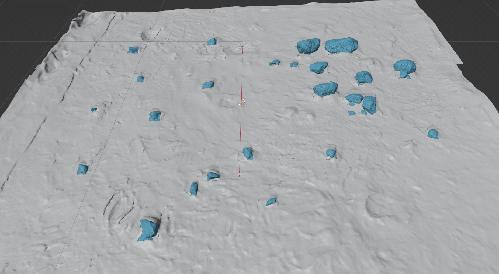

# POLAR-Sim
a database of bounding box labels and terrain meshes for the <a href="https://ti.arc.nasa.gov/dataset/IRG_PolarDB/" target="_blank">POLAR dataset</a>
<table>
	<tr>
		<td style="width:33%">
			<p style="text-align:center; margin-bottom: 0px">Terrain 1</p>
			
		</td>
		<td style="width:33%">
			<p style="text-align:center; margin-bottom: 0px">Terrain 2</p>
			
		</td>
		<td style="width:33%">
			<p style="text-align:center; margin-bottom: 0px">Terrain 3</p>
			
		</td>
	</tr>
	<tr>
		<td style="width:33%">
			<p style="text-align:center; margin-bottom: 0px">Terrain 4</p>
			
		</td>
		<td style="width:33%">
			<p style="text-align:center; margin-bottom: 0px">Terrain 5</p>
			
		</td>
		<td style="width:33%">
			<p style="text-align:center; margin-bottom: 0px">Terrain 6</p>
			
		</td>
	</tr>
	<tr>
		<td style="width:33%">
			<p style="text-align:center; margin-bottom: 0px">Terrain 7</p>
			
		</td>
		<td style="width:33%">
			<p style="text-align:center; margin-bottom: 0px">Terrain 8</p>
			
		</td>
		<td style="width:33%">
			<p style="text-align:center; margin-bottom: 0px">Terrain 9</p>
			
		</td>
	</tr>
	<tr>
		<td style="width:33%">
			<p style="text-align:center; margin-bottom: 0px">Terrain 10</p>
			
		</td>
		<td style="width:33%">
			<p style="text-align:center; margin-bottom: 0px">Terrain 11</p>
			
		</td>
		<td style="width:33%">
			<p style="text-align:center; margin-bottom: 0px">Terrain 12</p>
			
		</td>
	</tr>
</table>

# Ground meshes
The ground mesh for each terrain is stored in the following link due to their large file sizes.

<a href="https://uwmadison.box.com/s/gyhe2ggwb0v40ivbt7jx4pn6temadkbe" target="_blank">Box link</a>

# Logs
2/13/2025
Demo code for rendering rocks using Chrono::Sensor in Chrono 8.0 uploaded.

7/9/2024
1. Cover photo bugs fixed.
2. Ground in Terrain 1 revised.
3. Rock meshes and some ground meshes (smaller than 100 MB) in Terrains 2, 3, 5, 6, 7, 8, 9, 10, and 12 uploaded.
4. Link for ground meshes added.
5. Cover photo of meshes added.


# Cover photos of rock indices
Pictures in the *CoverPhotoOfIndices* folder show how we index the rocks in each terrain. The indices do not meet the label orders in the bounding box label txt files. The indices meet the rock ID of the mesh files in each terrain. Original pictures come from the POLAR dataset.

# Segmentation Labels
Please check the *SegmentationLabels* folder. The annotations were done with Roboflow. The bounding box label files in YOLO format are categorized in the terrain ID folders. Each txt file corresponds with one HDR photo of the POLAR dataset.

- The label files are named as the following rule:  
[terrain ID]\_[stereo camera position]\_[rover light on/off]\_[Sun azimuth]\_[Left/Right camera of the stereo camera]\_[exposure time in millisecond].txt,  
and "no" in [Sun azimuth] means that there was no simulated Sun (the spot light was turned off). 

In the YOLO text files, here are the following classes and their corresponding object:
- class 0 is background
- class 1 is ground
- class 2 is rocks
- class 3 is shadows

To convert a YOLO text file and corresponding POLAR image to a masked bitmap format, you can use the *yolo2bitmap.py* script. 

# Bounding box labels
Please check the *Labels* folder. The bounding box label files in YOLO format are categorized in the terrain ID folders. Each txt file meets with one HDR photo of the POLAR dataset.

- The label files are named as the following rule:  
[terrain ID]\_[stereo camera position]\_[rover light on/off]\_[Sun azimuth]\_[Left/Right camera of the stereo camera]\_[exposure time in millisecond].txt,  
and "no" in [Sun azimuth] means that there was no simulated Sun (the spot light was turned off).

- The photos of very low exposure time may not have shadow or rock labels, since the photos are so dark that the rocks and shadows are judged invisible by the annotator.

- If the photos have no corresponding label files, it means that the photos have no labels (usually due to nothing visible).

# Separated ground mesh and rock meshes of the terrain
Please check the *TerrainMeshes* folder. Meshes of the separated ground and rocks (rock IDs can be referred in the cover photos) of each terrain are built in obj files.

- The ground mesh for each terrain, named *terrain[terrain ID]_ground.obj*, was generated by removing all the rocks from the terrain and stored in another place. Please see [Ground mesh](#ground-meshes)

- The mesh files of rocks are named as the following rule: terrain[terrain ID]_rock[rock ID].obj

- The coordinate directions are defined as follows,  
+X: Sun azimuth 0 deg, +Y: Sun azimuth 90 deg, and +Z: upward of the sandbox

- The coordinate order in the obj files is defined as: (X, Y, Z).

- Those obj files with file name suffixed by "decimate-005" have only 5% vertices of original object meshes. Those files are used in contact models for collision detection/calculation (such as in PyBullet or Chrono) to mitigate computing loading and facilitate computing speed.

- Terrain 4: Rocks 16 and 17 in the cover photo were combined into Rock 16 mesh obj file, since they were indivisible along X, Y, or Z axis.

# Questions and bug logs
Please raise Issues if you have any questions or find any bug. Thank you for your contributions to make this project more complete!

# Paper citation
If you use the POLAR3D dataset, please consider citing our paper, which also includes some cases of how to utilize the POLAR3D dataset.

<a href="https://arxiv.org/abs/2309.12397" target="_blank">Paper</a>
```
@misc{chen2023polar3d,
      title={POLAR3D: Augmenting NASA's POLAR Dataset for Data-Driven Lunar Perception and Rover Simulation}, 
      author={Bo-Hsun Chen and Peter Negrut and Thomas Liang and Nevindu Batagoda and Harry Zhang and Dan Negrut},
      year={2023},
      eprint={2309.12397},
      archivePrefix={arXiv},
      primaryClass={cs.RO}
}
```

# Contributors
Advisor: Prof. Dan Negrut

Coordinators: Bo-Hsun Chen, Thomas Liang

Bounding box labeling: Bo-Hsun Chen (Terrain 1), Peter Negrut (the other terrains)

Terrain digitization: Bo-Hsun Chen (Terrains 1, 4, 11), Thomas Liang (Terrain 9), Peter Negrut (Terrains 2, 3, 5, 6, 7, 8, 10, 12)

Semantic segmentation labeling: the rest is ongoing

# Copyright
All rights reserved by the Simulation Based Engineering Lab in the University of Wisconsin-Madison
